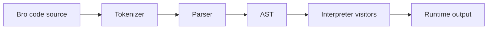

# Broo-code

Bro code is a toy programming language written in TypeScript.

This repository is private. The public way to use Bro code is the web playground.

- Website: https://broo-code.netlify.app/
- Direct playground section: https://broo-code.netlify.app//#playground

## Why this README exists

This README is designed to be publicly visible while the source repository remains private.
It documents the language, architecture, and technical approach without exposing internal-only details.

## Project status

- The project is actively experimental.
- The source repository is private.
- The project is currently not distributed via npm.

## Quick start (language)

Minimal program:

```bro
hi bro
  say bro "Hello bro";
bye bro
```

Expected output:

```text
Hello bro
```

## Language reference

### 1. Program boundaries

Every executable program starts with `hi bro` and ends with `bye bro`.
Anything outside those boundaries is ignored.

```bro
This will be ignored

hi bro
  // code here
bye bro

This too
```

### 2. Comments

- Single-line comments: `// ...`
- Multi-line comments: `/* ... */`

```bro
hi bro
  // single line comment
  /*
    multi line comment
  */
  say bro "comments work";
bye bro
```

### 3. Variables

Declare variables with `bro this is`.

```bro
hi bro
  bro this is a = 10;
  bro this is b = "two";
  bro this is c = 15;

  a = a + 1;
  b = 21;
  c *= 2;
bye bro
```

### 4. Types and literals

- Number: `10`, `20.5`
- String: `"hello"`, `'hello'`
- Null: `nope`
- Boolean true: `yep`
- Boolean false: `nah`

```bro
hi bro
  bro this is a = 10;
  bro this is b = 10 + (15 * 20);
  bro this is c = "two";
  bro this is d = 'ok';
  bro this is e = nope;
  bro this is f = yep;
  bro this is g = nah;
bye bro
```

### 5. Output

Use `say bro` to print values.

```bro
hi bro
  say bro "Hello World";
  bro this is a = 10;
  {
    bro this is b = 20;
    say bro a + b;
  }
  say bro 5, 'ok', nope, yep, nah;
bye bro
```

### 6. Operators

Supported operators include:

- Arithmetic: `+`, `-`, `*`, `/`, `%`
- Assignment: `=`, `+=`, `-=`, `*=`, `/=`, `%=`
- Equality: `==`, `!=`
- Relational: `>`, `<`, `>=`, `<=`
- Logical: `&&`, `||`

Notes:

- String concatenation is supported with `+`.
- Arithmetic with `nope` or boolean values can throw runtime errors.
- Division by zero throws a runtime error.

### 7. Conditionals

Use `if bro`, `else if bro`, and `else bro`.

```bro
hi bro
  bro this is a = 10;

  if bro (a < 20) {
    say bro "a is less than 20";
  } else if bro (a < 25) {
    say bro "a is less than 25";
  } else bro {
    say bro "a is greater than or equal to 25";
  }
bye bro
```

### 8. Loops

Use `while bro` for loops.

- `stop bro` breaks the loop.
- `next bro` continues to next iteration.

```bro
hi bro
  bro this is a = 0;

  while bro (a < 10) {
    a += 1;

    if bro (a == 5) {
      say bro "inside loop:", a;
      next bro;
    }

    if bro (a == 6) {
      stop bro;
    }

    say bro a;
  }

  say bro "done";
bye bro
```

### 9. Scope

Blocks create scope with `{ ... }`.

```bro
hi bro
  bro this is a = 10;
  {
    bro this is b = 20;
    say bro a + b;
  }
bye bro
```

## Architecture overview

Bro code follows a modular pipeline:

1. Tokenizer converts source code into tokens from grammar spec.
2. Parser builds an AST from the token stream.
3. Interpreter evaluates AST nodes using node-type visitors.
4. Playground (web app) runs code in-browser via interpreter package.



### Monorepo layout

- `apps/docs`: Next.js docs + playground UI.
- `packages/parser`: grammar, tokenizer, parser, AST node definitions.
- `packages/interpreter`: runtime evaluator and scope handling.
- `packages/cli`: command-line entrypoint for local file execution.
- `packages/config`: shared ESLint config package.
- `packages/tsconfig`: shared TypeScript config package.

## Technical details

### Core design choices

- Language implementation is fully in TypeScript.
- Parser and interpreter are separated into independent packages.
- Interpreter uses visitor dispatch by AST node type.
- Runtime scope is reset after each interpretation cycle.
- Turborepo manages builds, tests, and package orchestration.

### Runtime characteristics

- Dynamically typed runtime semantics.
- Block-scoped variable behavior.
- Explicit runtime exceptions for invalid operations.
- Control flow support for conditional branches and loops.

## Public links

- Playground and docs: https://broo-code.netlify.app/
- Playground section: https://broo-code.netlify.app//#playground

## License

MIT
